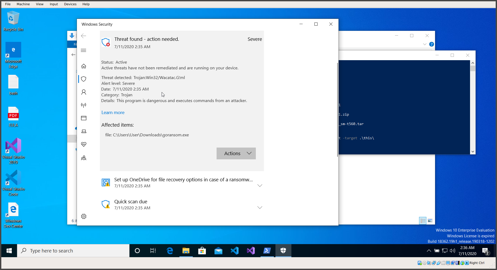

# goransom


This is a proof of concept for a simple ransomware written in Go. The purpose of this project is purely educative: I wrote `goransom` to get familiar with the language, this also means that the code is poorly written and organized.

**DO NOT USE THIS ON SYSTEMS WHERE YOU DON'T HAVE THE PERMISSION OF THE OWNER**

## Usage

After downloading the repository, navigate into the directory and build the project:

```
$ go build goransom.go
```

This will create an executable called `goransom`. You can then run the executable with the following flags:
- `-target`, to specify a folder or a file to encrypt/decrypt. If it's a directory, all the files contained in the given folder will be encrypted/decrypted.
- `-secret`, to specify the secret which is used to derive the key for the encryption/decryption.
- `-decrypt`, to be specified if we want to decrypt a file or a folder.

If you are building it for Windows on Linux, use:

```
$ GOOS=windows GOARCH=386 go build -o goransom.exe goransom.go
```

But be careful, Windows defender does not like goransom:




### Example

```
$ tree
.
├── goransom
└── testfolder
    └── testfile

$ cat testfolder/testfile
THIS IS A SUPER IMPORTANT FILE, PLEASE DON'T TAKE IT AWAY FROM ME

$ ./goransom -secret supersecret -target testfolder
Operating on testfolder
Operating on testfolder/testfile

$ tree
.
├── goransom
└── testfolder
    └── testfile.locked

$ cat testfolder/testfile.locked
�C4�w��i�G⛘]+�~O(�@f1
                     �<
                       �0k><�ZlEV&yj��;)�[1m%

$ ./goransom -secret supersecret -target testfolder -decrypt
Operating on testfolder
Operating on testfolder/testfile.locked

$ tree
.
├── goransom
└── testfolder
    └── testfile

$ cat testfolder/testfile
THIS IS A SUPER IMPORTANT FILE, PLEASE DON'T TAKE IT AWAY FROM ME
```

